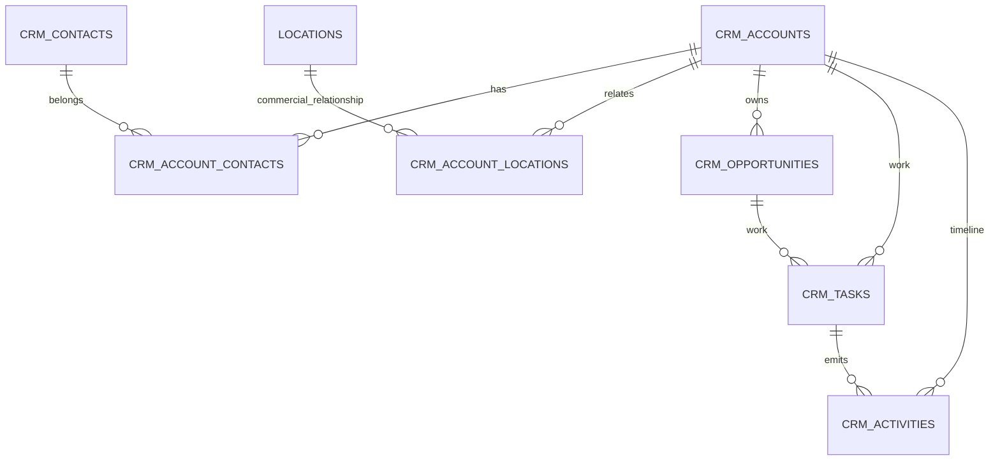

# Canonical CRM foundation — Phase 1

## Architecture and sources of truth



`crm_accounts`, `crm_contacts`, their junction tables, `crm_opportunities`, `crm_tasks`, and append-only `crm_activities` are the sources of truth for all new records. A location remains the canonical profile in `locations`; profile columns are never copied into an account. Lifecycle is commercial (`prospect` through `churned`) and remains separate from billing/subscription state.

Pipeline definitions are version-controlled in `lib/crm/pipelines.ts` and enforced independently in SQL. Business claim, Reserve Pro, promoted listing, partnership, and renewal/expansion deliberately have different stages.

## Permissions and audit

Browser RLS is deny-by-default except for authenticated superadmins/admins resolved from `admin_users` (never user metadata). Server-only modules use the service role only after `requireAdminRole`; read/write role matrices are centralized. This conservative first deployment does not grant location access to an entire account. Scoped role RLS can be expanded after assignment/location policy fixtures are available. Material helper writes emit `admin_audit_logs`; CRM activities remain a separate business timeline and contain no authorization evidence.

## Compatibility and overlaps

| Existing system | Phase 1 disposition |
|---|---|
| `locations` owner, claim outreach, next-action and sales-readiness columns | Bridged/read-only legacy source; existing location CRM remains operational. New records write canonical tables. |
| `location_claim_requests` and claim codes/audit | Reused as claim evidence; not migrated or deleted. |
| `customer_subscriptions` and production location billing | Billing reference/matching evidence only; subscription status is not lifecycle. |
| team assignments and beta task tables | Not CRM tasks; retained for their bounded workflows. No dual write. |
| support tickets, reservations, communications and outreach logs | Retained. Later adapters can append idempotent activities using source keys. |
| owner/location relationships | Trusted backfill evidence and compatibility source; not silently rewritten. |

## Backfill strategy

The matching order is trusted organization, claimed owner, billing customer, verified owner email plus business identity, parent group, then isolated location fallback. Names and phone numbers never merge records. `crm_migration_links` records source, target, migration version, strategy, confidence, and metadata under a rerun-safe unique key. Ambiguous fallback links use `review` confidence. The migration only creates schema: operators must preview and explicitly execute a separately reviewed backfill so production data is never silently changed.

## Migration runbook

1. **Preflight:** count locations/claims/owners/subscriptions; check duplicate owner and billing identities; take a backup; confirm no later `20260728120000` migration.
2. **Order:** deploy the additive SQL migration, generated types, server modules, then UI.
3. **Preview:** export proposed `{source, deterministic key, strategy, confidence}` rows; review every low/review-confidence group and franchise/brand collision.
4. **Execute:** upsert accounts and relationships in batches, then insert `crm_migration_links` in the same transaction. Reruns use the migration-link unique key.
5. **Validate:** compare linked distinct locations to expected scope; find orphan FKs; verify every opportunity stage against its pipeline; verify completed-task timestamps.
6. **Duplicates:** group active account-location relationship keys and normalized contact emails; expect zero duplicate keys.
7. **Disable/rollback:** turn off new navigation/actions and stop the backfill job. Tables are additive; do not drop them. Restore only incorrect batch rows identified by migration-link version after audit/backup review.
8. **Monitor:** activity-write errors, policy denials, task completion failures, account-list latency, duplicate conflicts, and unmatched/review-confidence counts.

Example validation SQL:

```sql
select account_id, location_id, relationship_type, count(*) from crm_account_locations where status='active' group by 1,2,3 having count(*)>1;
select count(*) from crm_tasks where (status='completed') <> (completed_at is not null);
select source_table, source_record_id, target_entity_type, migration_version, count(*) from crm_migration_links group by 1,2,3,4 having count(*)>1;
```

## Rollout limits and Phase 2

Not migrated: historical email/SMS bodies, automated sequences, support desk, reservations, onboarding, renewals, contracts, forecasting, or legacy derived labels. Phase 2 should add reviewed adapters for those systems, account/contact-to-location contact scope, scoped-role SQL fixtures, reconciliation dashboards, and an operator-approved production backfill. No destructive rollback is appropriate for this additive phase.
