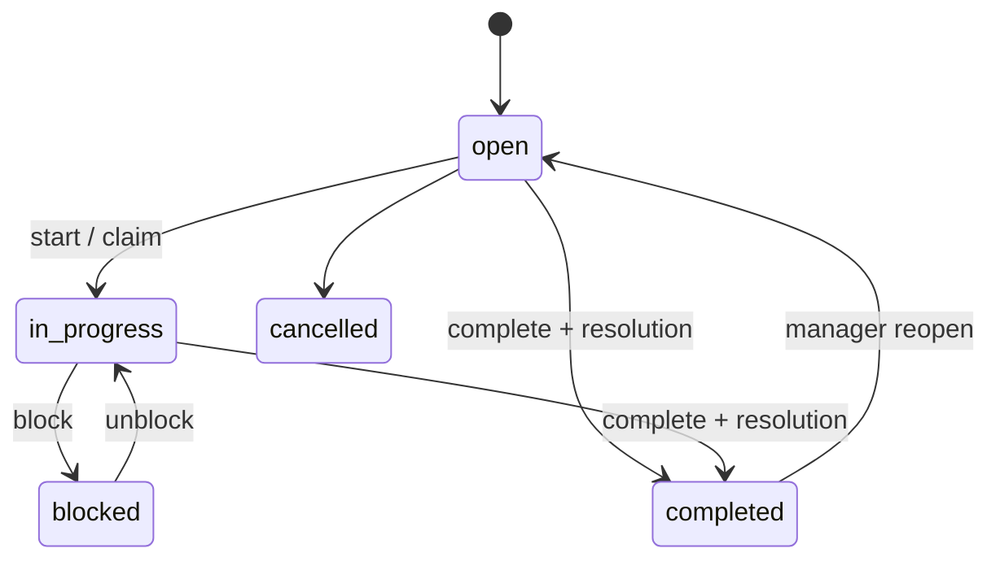
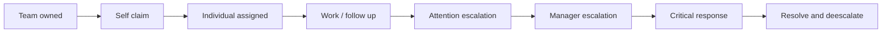
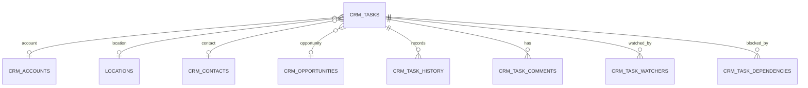
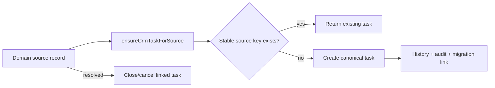

# CRM Phase 2 — Operational Work Queue

## Architecture and overlap audit

`crm_tasks` remains the canonical operational source. Claims, reservations, billing, owner onboarding, outreach, support, publishability repair, opportunities, renewals, and site visits remain **domain records linked to CRM tasks** through stable `(source, source_record_id, task_type)` keys. The legacy admin CRM tasks/follow-up fields and business CRM pages are **compatibility bridges / legacy read-only sources**; notification and cron tables outside CRM are canonical only for their domains. Historical logs are **future migration**, while duplicate placeholder queue surfaces are **safe to deprecate later**. No source data is deleted.

Server-only task services validate, authorize, use optimistic `version` matching, write append-only history and material admin audit events, and optionally promote material completion to `crm_activities`. Route components do not write tables directly. Bounded list queries join relationship labels and paginate at 25 rows.

## Queues, status, priority, and SLA

Queues are general, sales, outreach, claims, onboarding, support, reservations, billing, content, data quality, renewals, and partnerships. Status describes lifecycle; priority (`low` through `urgent`) orders normal work; escalation (`none`, `attention`, `manager`, `critical`) signals elevated attention. They are intentionally independent. SLA is centrally classified as `on_track`, `due_soon`, `at_risk`, `breached`, or `not_applicable`.

Defaults are one business hour for critical escalations, four for urgent support/reservations, one business day for high claims/billing, two business days for sales/outreach follow-up, and five business days otherwise. Business-hour calculation skips weekends; a future holiday-calendar integration is a known limitation.

## Relationship model

A task requires an account, location, contact, or opportunity and may carry several. Watchers receive internal updates without ownership. Dependencies never auto-complete downstream tasks and reject self/simple cycles. Comments are internal, length-limited, sanitized, soft-deletable, and represented in history without flooding account timelines.

## Permissions

Superadmins/admins manage all operational work. Managers oversee teams, shared views, escalation, quality and reassignment. Editors work content/data-quality scope. Ambassador roles work sales/outreach/claims/partnership scope. Experience roles work support/reservations/owner help/claim-help scope. Reviewers and viewers are read-only. Server role lookup—not user metadata—is authoritative. Existing location scoping remains mandatory before bridge enablement; explicit assignment/watch access must not reveal unrelated customer data.

## Views, saved views, bulk actions, and notifications

System views are My Queue, Due Today, Overdue, Follow-Ups, Unassigned, Blocked, Escalations, Completed and All Tasks; managers additionally see Team Queue, Unowned Work, SLA Risk and Recently Reopened. URL filters are validated against a controlled key set. Saved views can be personal, team, or shared, have one user default, and are archived rather than destructively deleted. Global sharing is manager-only at the service layer.

Bulk operations cap selection at 100, authorize/version-check every task, retain successful updates when another item fails, return per-task failure codes, write per-task history, and emit one summary audit event. Completion requirements still apply to every item.

Task notifications are internal and indexed by recipient. Assignment, mention, due, overdue, escalation, reopening, blocking and watcher events are supported. The secure reminder cron queries only bounded actionable indexed rows. Event-window idempotency prevents repeated notices; customer email/SMS is explicitly excluded.

## Source bridges and backfill

Bridges are implemented centrally but must be enabled only after each domain owner confirms trigger and closure semantics. The supported contract covers claim review/outreach, onboarding, reservation, support, publishability, billing, opportunity, renewal and site visit sources.

Backfill runs in preview by default and considers only deterministic table/record IDs. It reports source, created, skipped, ambiguous and failed counts, then records `crm_migration_links` when applied. It never matches titles or imports irrelevant historical logs. Current repository fixture preview: **0 created, 0 skipped, 0 ambiguous, 0 failed** (no database credentials/production data were used).

## Monitoring, deployment, and rollback

Monitor creation/completion/reopen counts, overdue/unassigned/escalated/SLA-breach gauges, bulk and notification failures, prevented bridge duplicates, and cron duration/errors. Never log contact PII. Deploy Phase 1 first, then `20260728180000_crm_operational_work_queue.sql`, refresh PostgREST schema/types, deploy services/routes, and finally schedule the cron. Validate constraints/indexes with `pg_indexes`, `pg_constraint`, and RLS policy catalog queries.

Rollback disables the cron and bridge callers first, then reverts application routes. The additive tables/columns remain to preserve history. Do not drop them until exports and dependency checks are complete. Known limitations: holiday calendars, deeper-than-simple database cycle prevention, source bridges not auto-enabled, and team/location scope needing domain-specific mappings. Phase 3 can add governed workflow automation, holiday calendars, richer opportunity UI, and explicit domain bridge rollout.
