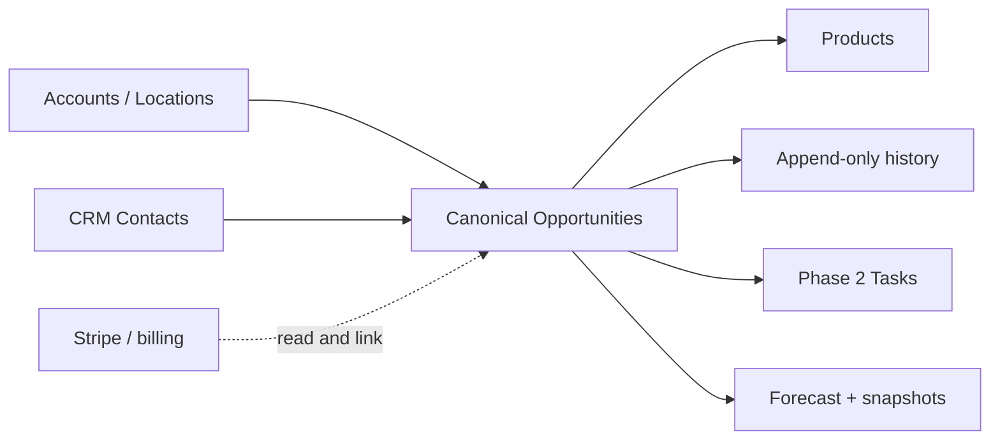
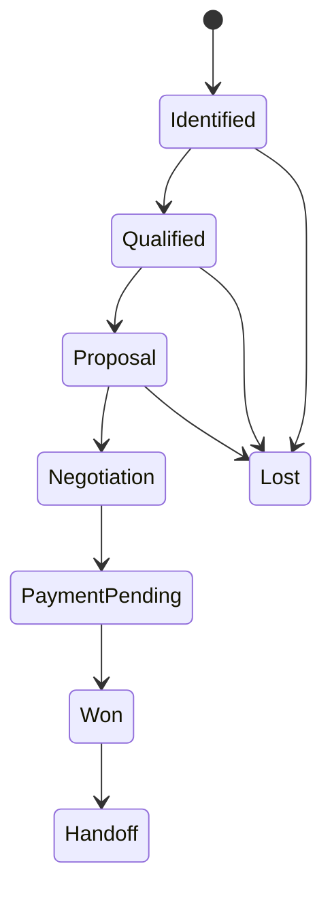
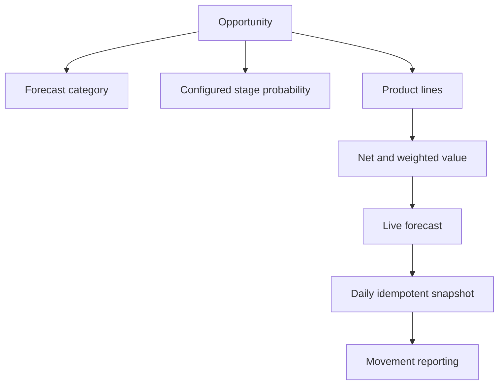
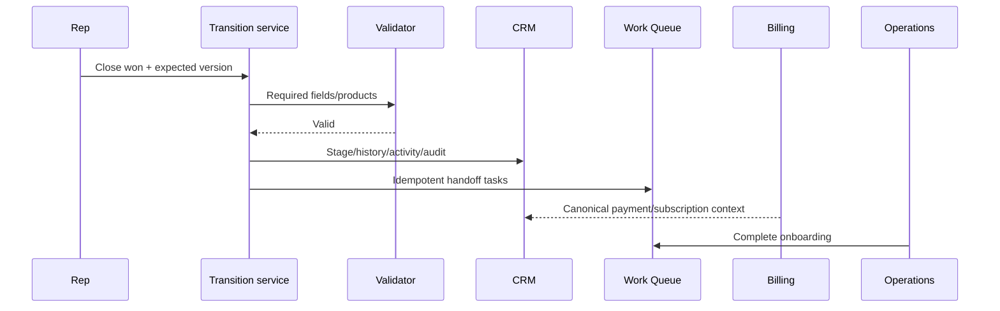
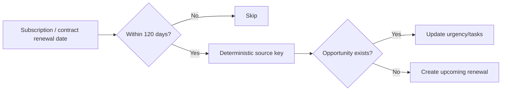
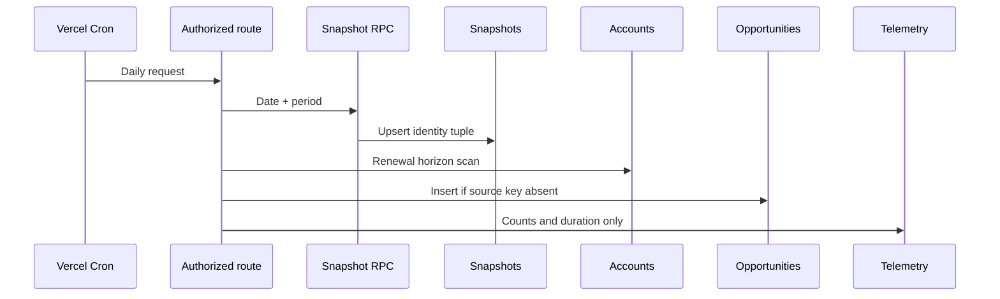

# CRM Phase 3: pipelines and forecasting

## Architecture and overlap classification

Phase 3 extends, rather than replaces, the Phase 1 `crm_opportunities` record and Phase 2 `crm_tasks`/Work Queue. The canonical CRM owns opportunity identity, stages, contacts, products, history, forecasts, and handoff state. Existing systems remain classified as follows:

| Commercial system | Classification | Phase 3 behavior |
|---|---|---|
| `crm_opportunities`, accounts, contacts, activities | Canonical CRM source | Extended additively |
| Claims, owner onboarding, promoted listings | Operational source linked to CRM | Link by deterministic source identifiers; never delete |
| Stripe subscriptions, invoices, payments, promo codes | Billing source linked to CRM | Read-only context; billing remains authoritative |
| Ambassador outreach and upgrade pages | Legacy compatibility source | Eligible for preview-first linking |
| Historical trials and old renewals | Future migration | Migrate only where identity is unambiguous |
| Duplicate commercial status fields | Safe to deprecate later | Retain until reconciliation is complete |

## Pipelines, stages, and transitions

The controlled, idempotently seeded pipelines are:

- **Business Claim:** identified → outreach pending → contacted → engaged → claim sent → claim started → claim review → claimed; closed lost is available from open stages.
- **Reserve Pro:** identified → qualified → demo scheduled → demo completed → proposal → negotiation → payment pending → closed won; closed lost is available from open stages.
- **Promoted Listing:** identified → qualified → proposal → payment pending → active; closed lost is available from open stages.
- **Partnership:** identified → discovery → qualified → proposal → legal review → closed won; closed lost is available from open stages.
- **Renewal / Expansion:** upcoming → review → expansion identified → proposal → negotiation → renewed. `expanded` is a successful alternate outcome and `churned` is the loss outcome.

Transition maps are explicit and centralized. Normal movement is to the next configured stage or the loss outcome. Manager/admin override requires a reason. Proposal needs amount or a product; negotiation needs next action and close date; payment pending needs proposal/contract context; won needs account, value, date, and owner; loss needs a reason; renewal and expansion enforce their specialized completion data. Optimistic `version` checks prevent silent overwrite.

## Forecast and product model

Forecast category is independent from stage: `pipeline`, `best_case`, `commit`, `closed`, or `omitted`. Formulas are:

- **Weighted amount** = `round(amount × probability / 100, 2)`, database-generated.
- **Open pipeline** = open, non-omitted amount.
- **Best case / commit** = amount assigned to that category.
- **Closed** = successful actual amount.
- **Win rate** = wins ÷ (wins + losses); empty denominators produce no value.
- **Coverage** = open pipeline ÷ target; when no target exists the UI says **Not configured**.

Products are opportunity-specific line items with quantity, unit price, centrally calculated discounts/net amount, billing cadence, term, and optional location. Claim conversion carries no assumed value. Contact roles describe a contact's influence on one opportunity and do not duplicate the canonical account contact.

## Pipeline health

Rules are deterministic and return a status plus reasons. Signals include missing/overdue next step, past close date, excess stage age, inactivity, missing primary contact/economic buyer, missing task, proposal/contract/payment delay, high discount, close-date pushes, reopen, and critical risk on commit. Statuses are `healthy`, `attention`, `at_risk`, and `stalled`; no opaque scoring is used.

## Closed won, closed lost, and handoff

A successful transition records actual close date, stage/activity/audit history and enters a controlled handoff. Tasks use source identifiers so retries do not duplicate them. A paid product is never activated from CRM alone; Stripe/billing confirmation remains required.

Closed lost requires reason and category (`no_response`, `not_interested`, `budget`, `timing`, `competitor`, `missing_feature`, `pricing`, `internal_change`, `duplicate`, `invalid_account`, `churn`, or `other`). Competitor, notes, and a future follow-up are optional; loss does not blacklist an account.

## Renewals and expansion

The daily commercial job scans canonical account renewal dates through 120 days, creates one deterministically keyed renewal opportunity, and recognizes it on subsequent 90/60/30-day runs. Expansion signals enter review and do not automatically become qualified pipeline.

## Permissions

| Role | Read | Mutate | Reassign/commit/override | Billing/pricing authority |
|---|---|---|---|---|
| Superadmin/Admin | All scoped | Yes | Yes | Admin policy |
| Manager | Team scope | Yes | Yes, reason required | Manager threshold |
| Ambassador | Owned/team scope | Yes | No override | 0–10% |
| Partner ambassador | Permitted/assigned | Yes | No override | 0–10% |
| Experience Team | Handoff/support context | Handoff tasks only | No | None |
| Editor | Relevant context | Content deliverables only | No | None |
| Reviewer/Viewer | Scoped read | No | No | None |

Authorization uses canonical `admin_users`, never `user_metadata`. Browser tables have RLS enabled and only the existing fixed-search-path admin predicate; server mutations resolve the authenticated actor and apply owner/team scope. Discount thresholds are owner 0–10%, manager 11–20%, and admin over 20%, with approval history.

## Backfill strategy

Backfill is preview-first. Readers classify claim, claim-code, trial, subscription, promoted-listing, onboarding, upgrade, ambassador, renewal, and payment-pending records; deterministic `(source_system, source_record_id, pipeline)` identities and `crm_migration_links` make application idempotent. Output must include created, linked, skipped, ambiguous, and failed counts. It never infers price, treats account existence as a win, duplicates a subscription, or creates current claim work for an already claimed location.

## Cron, monitoring, and operations

`/api/cron/crm-commercial` runs daily using established cron authorization. It creates an idempotent forecast snapshot and renewal opportunities. Health refresh, stalled-task creation, and close-date hygiene are additive follow-on workers; none auto-close deals. Telemetry uses aggregate IDs/counts only: created/won/lost, values, win rate, cycle time, stalls, overdue work, transition failures, snapshot duration, renewals, duplicates prevented, handoff/backfill failures. It excludes PII, notes, and contract contents.

## Deployment and rollback

1. Apply Phase 1, then Phase 2, then `20260728220000_crm_phase3_pipeline_forecasting.sql`.
2. Validate pipeline/stage counts, constraints, indexes, RLS, generated values, and snapshot RPC grants.
3. Deploy server services and read-only pages; then enable mutations; then enable daily cron.
4. Run backfill preview, review ambiguity, and apply a bounded batch.
5. Regenerate database types against the deployed schema.

Rollback disables the cron and routes first. Because migration is additive, retain tables/history and roll application traffic back. Do not drop columns or billing links during incident rollback. If necessary, disable mutations with feature access while preserving reads.

## Known limitations and Phase 4 handoff

Phase 3 does not provide CPQ, e-signature, accounting, customer proposal portal, arbitrary workflows, automated sequences, AI rep scoring, or subscription activation. Owner/team profiles and revenue target administration may require environment-specific configuration. Phase 4 can add notification delivery, approval UX, richer target planning, bounded bulk tools, and workflow automation on the stable service/history primitives.
