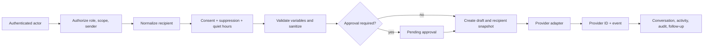
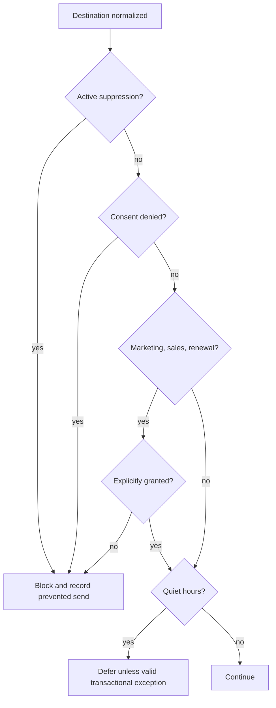
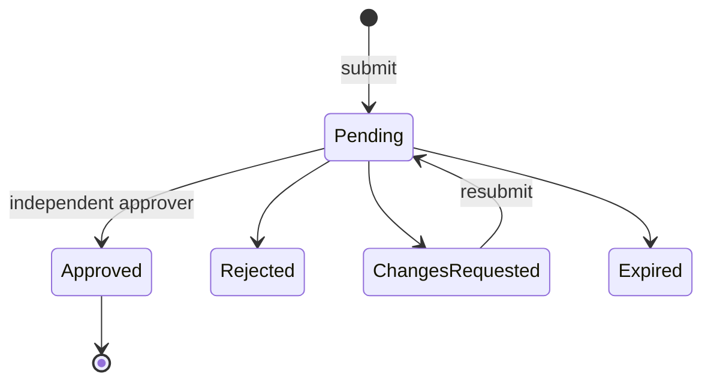
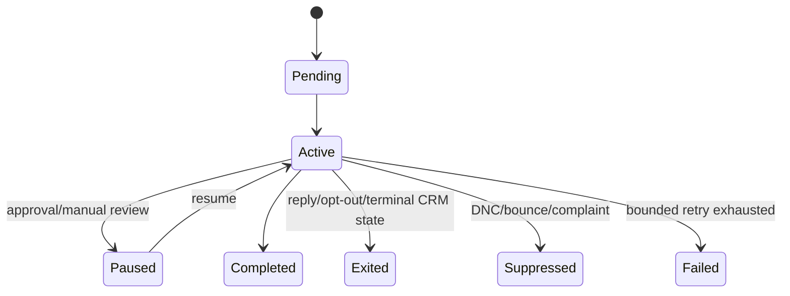
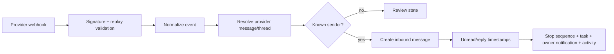
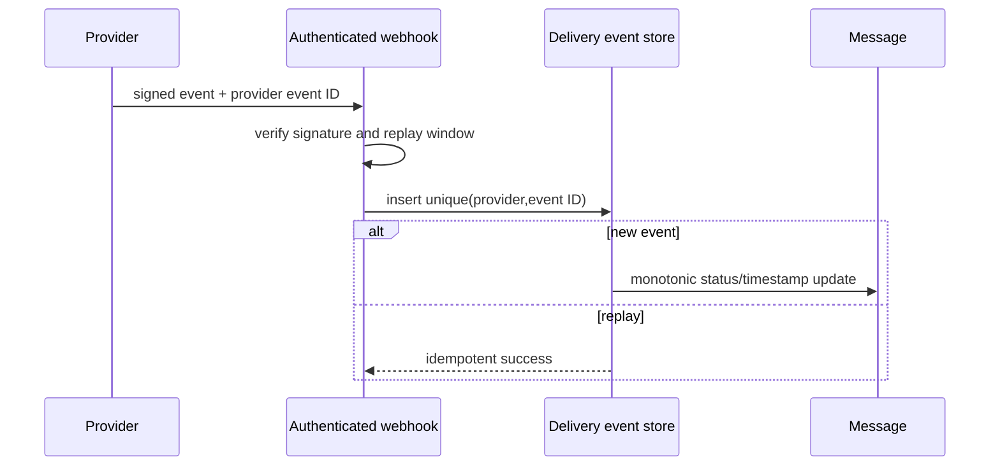

# CRM Phase 4 — communications and engagement

## Architecture and canonical decisions

`crm_conversations` and `crm_messages` are the canonical CRM index and timeline. They do not replace operational sources. Provider identifiers and stable `(source_system, source_record_id)` keys link Resend, support, reservation, claim, notification, and future SMS records without duplicating threads. Recipient and provider event records are separate so BCC data and raw provider payloads can remain restricted.

### Existing-system inventory

| Existing system | Classification | Phase 4 use |
|---|---|---|
| `lib/email/*` and Resend | Provider delivery source | Reused through the email adapter; branded rendering and sender mapping remain authoritative |
| Reservation email Edge Functions | Domain-specific source | Preserved and bridged by stable reservation IDs |
| `notification-worker` and notification records | Domain-specific source | Indexed as notification conversations; not replaced |
| Support tickets and conversation UI | Domain-specific source | Linked with `support_ticket_id`; ticket lifecycle remains authoritative |
| Claim and owner onboarding email flows | Domain-specific source | Draft sequence catalog and source bridges; no automatic enrollment |
| Marketing Center/Studio | Legacy read-only source / future migration | Preview-first backfill; existing campaigns remain intact |
| `admin_communication_center.sql` | CRM compatibility bridge | Retained; canonical writes target Phase 4 tables |
| Twilio dependency | Provider delivery source (unconfirmed configuration) | No SMS sending is activated until an existing verified sender/webhook is configured |

### Component boundaries

UI and route handlers call server-only communication services. Provider SDK payloads remain in adapters. The existing `sendRenderedEmail` Resend boundary is reused. No React component imports a provider SDK. Authorization derives from `admin_users`, never client actor IDs or JWT `user_metadata`.



## Conversation and message models

A conversation must link at least one CRM or operational entity and has a unique deterministic key. Provider thread IDs are indexed. Messages preserve direction, source, provider IDs, real lifecycle timestamps, AI-assistance disclosure, and soft deletion. Internal notes require `direction=internal`, `channel=internal`, and never enter adapters. Lists use 25-row server pagination; detail is bounded to 100 messages.

## Consent and suppression

Preferences are unique by contact, channel, and communication type. Marketing, sales, and renewal require explicit `granted`; a phone number never implies SMS consent. Transactional permission is distinct. Active suppression wins over every preference. Suppression lifting preserves the record, requires actor and timestamp, and is auditable. Scheduled delivery must repeat the decision immediately before provider invocation.



## Sender identities and providers

The migration seeds the sender addresses already defined by the email brand registry: `hello@`, `business@`, `support@`, `reserve@`, and `admin@`. Role arrays restrict use and arbitrary From addresses are impossible. Resend remains the email provider. SMS remains disabled until the existing Twilio installation has a verified sender and authenticated inbound/status webhooks.

## Templates and variables

Templates are stable records; immutable numbered versions contain content and approval. Active versions are explicit. The registry permits only documented names (contact, account, location, opportunity, task, reservation, claim, owner, sender, and company support fields). Unknown or unresolved variables fail closed. HTML removes scripts, event handlers, and JavaScript URLs before delivery/display. Production should add a battle-tested allowlist sanitizer before enabling rich author-authored HTML.

## Approval workflow



Manager/admin/superadmin roles may approve within scope. Requesters cannot approve their own restricted content. A superadmin exception requires a non-empty reason. Decisions and overrides must create audit events without message bodies.

## Sequences and exit rules

Nine requested sequence records are installed as **drafts**, with no steps and no enrollments. A sequence becomes active only after review and explicit activation. Enrollments are unique per active contact/sequence and source bridges are idempotent.



The runner must select only a bounded due batch, lock rows with `FOR UPDATE SKIP LOCKED`, persist a step-start idempotency event, recheck permission/consent/suppression/exit state, and then advance. Replies, opt-outs, hard bounces, claim completion, terminal opportunities, resolved reservation issues, archived accounts, removed contacts, rejected approval, and manual stop exit or pause. Sequence events are append-only.

## Inbound and provider events





Provider status is never fabricated: delivered/opened/clicked/replied timestamps require real events. Payloads exclude credentials and are not selected into routine client queries. Hard bounce, complaint, and unsubscribe create suppression.

## Permissions and RLS

| Role | Read | Send | Approve | Configure provider |
|---|---:|---:|---:|---:|
| Superadmin | all | yes | yes | yes |
| Admin | all | yes | yes | limited |
| Manager | scoped/team | yes | permitted | no |
| Ambassador | assigned sales/claims | approved content | no | no |
| Partner Ambassador | assigned partnership/claims | approved content | no | no |
| Experience Team | assigned operational/support | approved content | no | no |
| Editor | approved context | no restricted sends | submit only | no |
| Reviewer / Viewer | scoped read-only | no | no | no |

RLS uses a fixed-search-path `SECURITY DEFINER` role lookup with explicit authenticated grant. Read-only roles have no write policy. The first migration provides the role baseline; deployment must add account/location/team scope predicates using canonical Phase 1 assignment functions before production data access is enabled. BCC and provider-payload projections must remain server-only.

## Backfill strategy and preview

`previewCommunicationBackfill()` probes known source tables without writing. Import runs must report scanned/created/linked/skipped/ambiguous/failed, preserve IDs, timestamps, direction and status, set historical consent to `unknown`, and never invent contacts or replies. Stable source keys and unique indexes make reruns safe.

## Monitoring and analytics

Emit counts/latencies only: drafted, sent, delivered, failed, bounced, replies, opt-outs, complaints, prevented sends, approval age, enrollments, duplicate prevention, webhook failures, unknown senders, first-response time, tasks, cron duration, and provider latency. Never emit addresses, phones, bodies, or provider payloads. Attribution is linkage-based (influenced), never causal revenue.

## Deployment order

1. Back up and run inventory/preview in staging.
2. Apply `20260728180000_crm_phase4_communications.sql`.
3. Verify constraints, indexes, RLS, grants, and seeded drafts.
4. Deploy server-only modules and read workspaces.
5. Configure/test Resend event authentication; then enable one-to-one email.
6. Validate Twilio configuration before enabling SMS.
7. Run source-specific preview and reviewed backfill.
8. Activate templates and sequences individually after approval.

### Validation SQL

```sql
select tablename, rowsecurity from pg_tables where schemaname='public' and tablename like 'crm_%';
select indexname from pg_indexes where schemaname='public' and indexname like 'crm_%';
select sequence_key,status from crm_sequences order by sequence_key;
select provider, provider_event_id, count(*) from crm_delivery_events where provider_event_id is not null group by 1,2 having count(*)>1;
select sequence_id,contact_id,count(*) from crm_sequence_enrollments where status in ('pending','active','paused') group by 1,2 having count(*)>1;
```

## Rollback plan

Disable cron/webhooks and outbound feature flags first; preserve records; revert application reads to legacy views. Drop Phase 4 policies/functions and tables only in a separately reviewed rollback migration after exporting source links. Never delete provider or legacy/domain records. Sender/provider credentials are unchanged by this phase.

## Known limitations and Phase 5 handoff

The current increment establishes schema, guardrail primitives, real read workspaces, seeded draft sequences, and the Resend adapter. Production activation still requires scoped RLS predicates, authenticated provider webhook routes, transactional compose mutations/audit/activity integration, locking sequence runner, source-specific import mappings, rich HTML allowlist sanitizer, configured rate-limit storage, and the requested parent-entity panels. Twilio is intentionally inactive until configuration is verified. Phase 5 can consume canonical engagement data but must not infer causality or consent.
