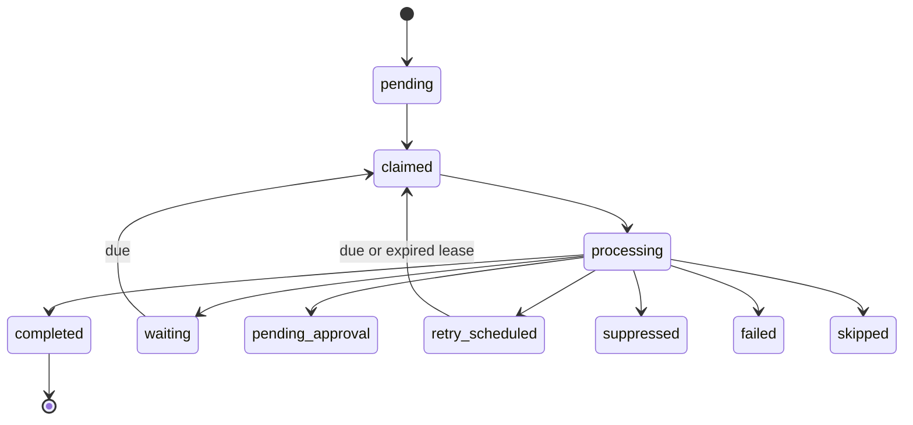

# CRM Phase 5 automation

## Architecture

The service-role runner loads the singleton kill switches, creates a run record, and calls `crm_claim_due_sequence_enrollments`. The RPC locks due enrollment rows with `FOR UPDATE SKIP LOCKED`, creates or recovers the unique execution ledger row, and leases a bounded batch. Browser code never invokes claim functions. Each enrollment is isolated so one failure is retained in the run summary rather than aborting the batch.



## Lifecycle and safety

Executions are identified by `enrollment_id:step_order:generation`; generation 1 is the default. Database uniqueness is the side-effect boundary. A new generation is required for an explicit restart, preventing an accidental resend of a completed email. Advancement conditionally updates the enrollment's current order and clears `next_step_at` at completion. Sequence events and structured logs contain identifiers and codes, never bodies, recipient details, or credentials.

Supported step types are `email`, `wait`, `task`, `manual_review`, `internal_notification`, and `exit_check`; SMS is intentionally unsupported. Wait configuration accepts positive minutes, hours, or days and optional `HH:mm`. Conditions are structured and allowlisted—no SQL or JavaScript evaluation is supported.

Retries are limited to transient failures: after the initial attempt, delays are 5 minutes, 30 minutes, and 2 hours; attempt four is final. Consent denial, unsubscribe, suppression, bounce, complaint, invalid recipient, unauthorized sender, missing approved template, and malformed relationships/configuration are permanent.

Before email delivery, the Phase 4 adapter must resolve an active authorized sender (step, sequence owner, enrollment owner, approved default), use an active approved template version and controlled renderer, and persist rendered/template/sender/consent/suppression snapshots. It must check preferences, do-not-contact, expiry, suppressions, bounce, complaint, unsubscribe, invalid/provider suppression immediately before sending. These rules are not duplicated in the runner.

Automated sequence message history is the source for rolling limits (one per 24 hours and three per seven days). Quiet hours use contact, location, account, then the configured default timezone. A temporary block schedules the earliest valid time without a permanent failure. Internal notifications never count.

## Operations

`POST /api/cron/crm-sequence-runner` (and Vercel-compatible GET) requires `Authorization: Bearer $CRON_SECRET` or the existing secret header. Required production environment: `CRON_SECRET`, Supabase URL/service key, and the existing email provider variables. `CRM_AUTOMATION_ENABLED=false` is an additional emergency override; `CRM_SEQUENCE_BATCH_SIZE` and `CRM_SEQUENCE_LEASE_SECONDS` optionally cap database settings.

Emergency stop: set the database global or email switch false and record a reason; optionally set `CRM_AUTOMATION_ENABLED=false`, deploy, and inspect running/leased work. The migration seeds global and email automation disabled. Rollout: migrate, deploy, inspect the dashboard, invoke disabled, enable tasks, test one internal task, enable one internal `@theouthaven.com` email sequence, verify message/recipient/delivery/execution/events, then expand gradually. Roll back by disabling first; revert application code only after leases expire. Do not drop the ledger during rollback.

Known limitation: provider-specific automated email, canonical task, approval, and notification adapters must be wired to the corresponding Phase 4 deployment schema; the runner fails safely rather than using browser-authenticated or parallel delivery systems.

## Health and validation SQL

```sql
select execution_key,count(*) from crm_sequence_step_executions group by 1 having count(*)>1;
select enrollment_id,step_order,generation,count(*) from crm_sequence_step_executions group by 1,2,3 having count(*)>1;
select * from crm_sequence_step_executions where status='processing' and lease_expires_at<now();
select * from crm_sequence_step_executions where status in ('claimed','processing') and lease_expires_at<now();
select * from crm_sequence_enrollments where status='active' and next_step_at<now();
select e.* from crm_sequence_enrollments e join crm_sequence_step_executions x on x.enrollment_id=e.id where e.status='completed' and x.status in ('pending','claimed','processing','retry_scheduled');
select x.* from crm_sequence_step_executions x join crm_sequence_enrollments e on e.id=x.enrollment_id join crm_contacts c on c.id=e.contact_id where x.status in ('pending','claimed') and coalesce(c.do_not_contact,false);
select contact_id,date_trunc('day',created_at),count(*) from crm_messages where direction='outbound' and metadata->>'automation_source'='sequence' group by 1,2 having count(*)>1;
select ev.* from crm_sequence_events ev left join crm_sequence_step_executions x on x.id=(ev.metadata->>'execution_id')::uuid where ev.metadata?'execution_id' and x.id is null;
select x.id,x.message_id from crm_sequence_step_executions x left join crm_messages m on m.id=x.message_id where x.message_id is not null and m.id is null;
select s.id from crm_sequences s left join crm_sequence_steps st on st.sequence_id=s.id where s.status='active' group by s.id having count(st.id)=0;
select e.id from crm_sequence_enrollments e join crm_sequences s on s.id=e.sequence_id where e.status='active' and s.status='archived';
```
